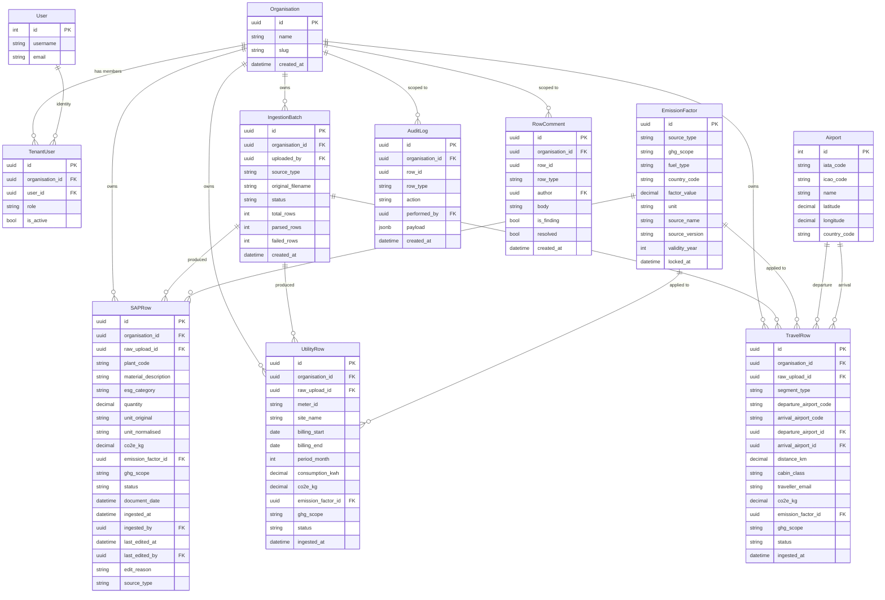
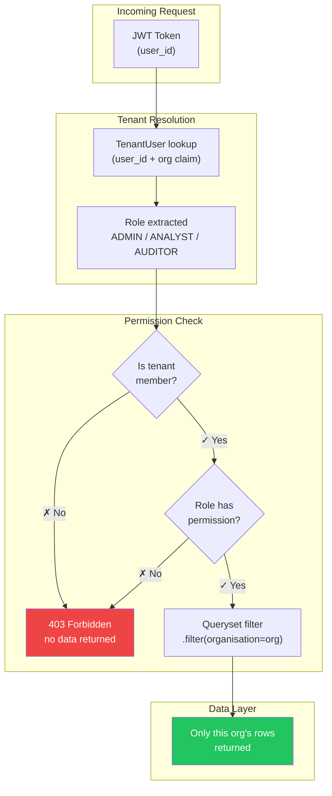
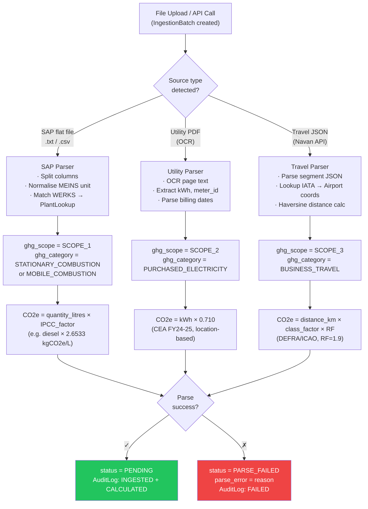
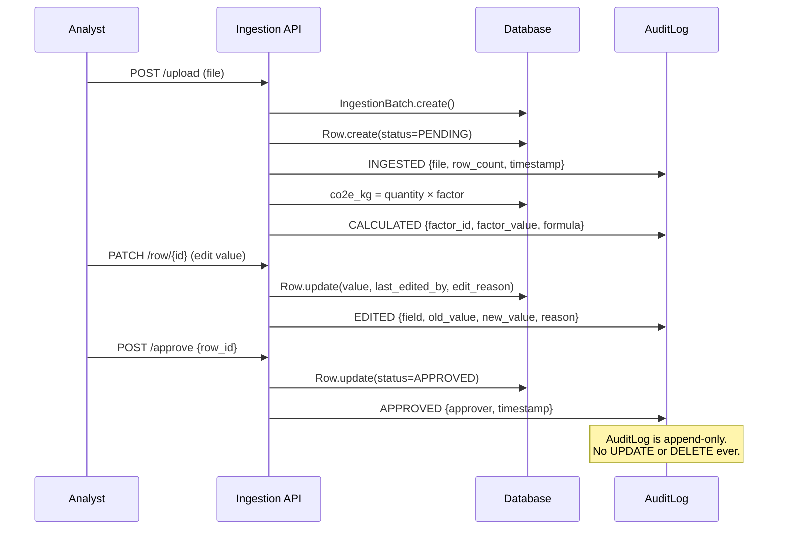
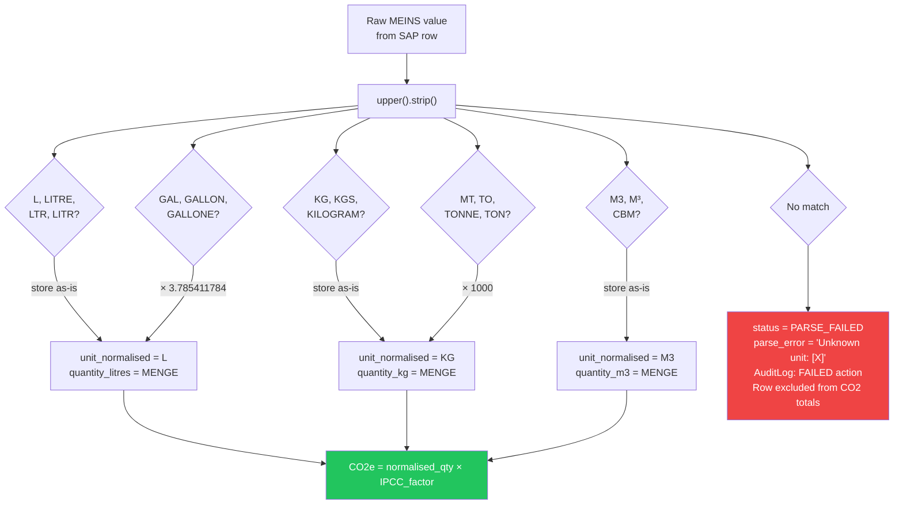
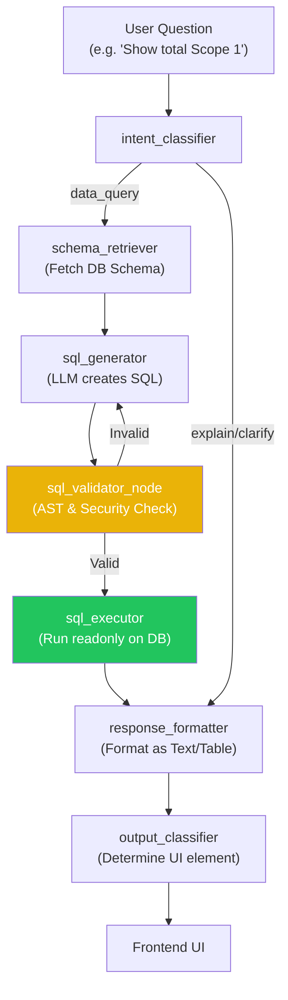

# MODEL.md — Data Model

```
┌─ TL;DR ──────────────────────────────────────────────────────────┐
│ Multi-tenant Django ORM with row-level tenant isolation.         │
│ Every row belongs to one Organisation; scope is auto-assigned    │
│ by parser type (SAP→S1, Utility→S2, Travel→S3).                 │
│ Biggest risk: missing tenant FK on a new model leaks all data.   │
└──────────────────────────────────────────────────────────────────┘
```

---

## 1 · FULL ENTITY RELATIONSHIP DIAGRAM



---

## 2 · MULTI-TENANCY ARCHITECTURE



**RBAC Hierarchy:**

| Role | Upload | Review | Approve/Reject | Lock | Admin |
|------|--------|--------|----------------|------|-------|
| ADMIN | ✓ | ✓ | ✓ | ✓ | ✓ |
| ANALYST | ✓ | ✓ | ✓ | ✗ | ✗ |
| AUDITOR | ✗ | ✓ (read) | ✗ | ✓ | ✗ |
| VIEWER | ✗ | ✓ (read) | ✗ | ✗ | ✗ |

---

## 3 · SCOPE 1/2/3 CATEGORISATION FLOW



---

## 4 · SOURCE-OF-TRUTH TRACKING

**Fields on every row model:**

| Field | Purpose | Editable? |
|---|---|---|
| `source_type` | SAP / UTILITY / TRAVEL | ✗ Immutable |
| `source_file` | original filename from `IngestionBatch` | ✗ Immutable |
| `ingested_at` | creation timestamp | ✗ Immutable |
| `ingested_by` | user FK (null if system trigger) | ✗ Immutable |
| `parsed_by_version` | parser semver string e.g. `sap-parser@1.4.2` | ✗ Immutable |
| `emission_factor_id` | FK to `EmissionFactor` — factor locked at calc time | ✗ Immutable |
| `last_edited_at` | null if never manually edited | ✓ System-set |
| `last_edited_by` | user FK | ✓ System-set |
| `edit_reason` | required free-text if row is edited | ✓ Analyst |
| `is_system_derived` | True if co2e_kg was auto-calculated | ✓ System-set |

**Lifecycle Sequence:**



---

## 5 · UNIT NORMALISATION FLOWCHART



> Analyst path after FAILED row: download error report → fix source file → re-upload. No silent best-guess is ever attempted.

---

## 6 · AI CHATBOT TEXT-TO-SQL FLOW


