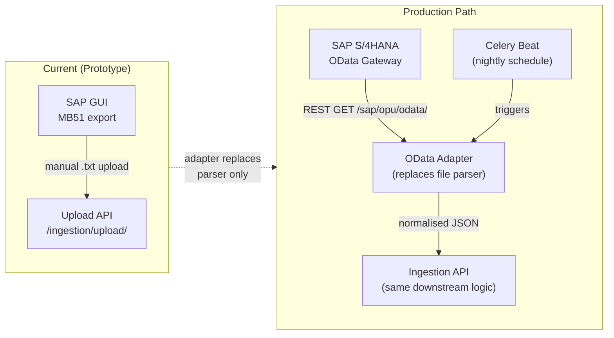
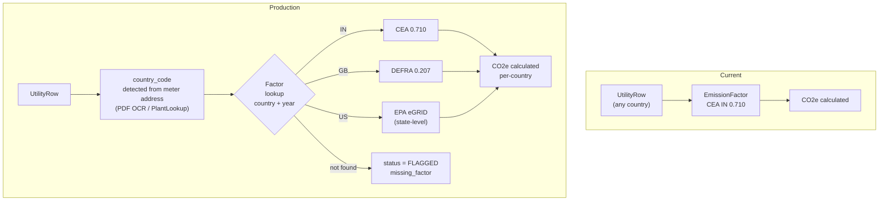
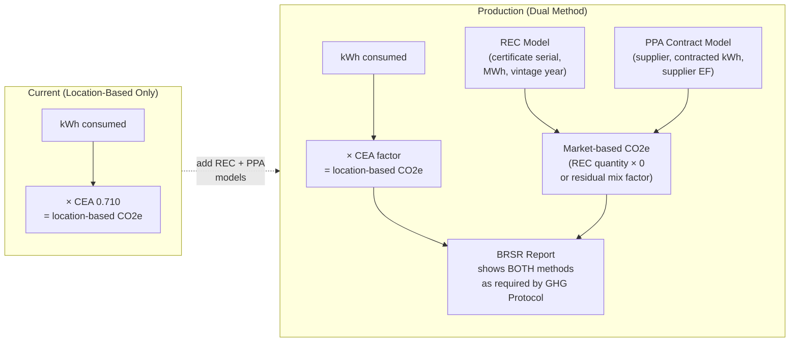

# TRADEOFFS.md — Deliberate Tradeoffs

```
┌─ TL;DR ──────────────────────────────────────────────────────────┐
│ Three features deliberately excluded to ship a working prototype.│
│ Most impactful omission: real-time SAP integration (OData/RFC).  │
│ Biggest audit risk: single-country emission factor covers only   │
│ India grid; overseas facilities would report zero Scope 2.       │
└──────────────────────────────────────────────────────────────────┘
```

---

## TRADEOFF 1 · Real-Time SAP Integration

**What was NOT built:**
- OData service connector (SAP Gateway / BTP)
- RFC/BAPI polling or IDocs subscription

**Why not:**
SAP OData exposure requires BASIS team involvement, firewall rules, and a dedicated SAP Gateway server — none of which can be prototyped without actual client SAP credentials. Delivery time would be weeks, not days.

**What was built instead:**
Manual flat-file upload — analyst exports MB51/ME2M from SAP GUI and uploads the `.txt` file.

**Production path:**



**What must change:** Parser module replaced by an `ODataClient` class; ingestion downstream (normalisation → CO2 calc → AuditLog) is identical.

**Risk if ignored:**
Analyst forgets monthly export → BRSR submission based on incomplete data with no automated freshness alert.

---

## TRADEOFF 2 · Multi-Country Emission Factors

**What was NOT built:**
- UK DEFRA grid intensity factors (per kWh, updated quarterly)
- US EPA eGRID state-level factors (52 grid regions)
- EU AIB residual mix factors (per country, per year)

**Why not:**
Building a complete multi-country factor registry requires sourcing, validating, and versioning 100+ factors from 15+ regulatory bodies — a standalone data engineering task beyond a prototype sprint.

**What was built instead:**
India CEA V20.0 factor only: `0.710 kgCO2e/kWh` for all `UtilityRow` records, applied uniformly regardless of meter location.

**Production path:**



**What must change:** `EmissionFactor` table already has `country_code` field. Add factor rows per country + add `country_code` detection step in Utility parser.

**Risk if ignored:**
An overseas facility reports electricity consumption → system applies India CEA factor → Scope 2 figure is wrong by up to 3.5× (UK grid is ~0.207 vs India 0.710); assurance firm flags material misstatement.

---

## TRADEOFF 3 · Market-Based Scope 2 Accounting

**What was NOT built:**
- Renewable Energy Certificate (REC) model and tracking
- Power Purchase Agreement (PPA) contract management
- Supplier-specific emission factors from Energy Attribute Certificates

**Why not:**
Market-based Scope 2 requires legal contract data (PPAs), certificate serial numbers (RECs), and supplier-specific residual mix factors — none of which exist in a standard utility bill. It is a distinct data collection and verification workflow.

**What was built instead:**
Location-based Scope 2 only — `co2e_kg = consumption_kwh × 0.710` using the CEA national grid average. This is GHG Protocol compliant as a minimum disclosure.

**Production path:**



**What must change:** Add `REC` model, add `PPA` model, link both to `UtilityRow`, add dual-column BRSR export. `UtilityRow.co2e_kg` becomes `co2e_kg_location` + `co2e_kg_market`.

**Risk if ignored:**
Client has solar PPA or REC purchases → legally entitled to report lower market-based Scope 2 → using location-based only overstates emissions → reputational and disclosure accuracy risk in public BRSR filing.
